# AI 에이전트 지침: .context 시스템

이 문서는 **imprun 조직의 모든 프로젝트에서 `.context` 디렉토리를 활용하는 AI 에이전트**를 위한 포괄적인 지침서입니다.

---

## 목차

1. [핵심 원칙](#핵심-원칙)
2. [.context 디렉토리 구조](#context-디렉토리-구조)
3. [문서 작성 가이드](#문서-작성-가이드)
4. [Serena MCP 연동](#serena-mcp-연동)
5. [명령어 처리 흐름](#명령어-처리-흐름)
6. [GitHub 연동 전략](#github-연동-전략)
7. [Mermaid 다이어그램 작성](#mermaid-다이어그램-작성)
8. [일일 작업 루틴](#일일-작업-루틴)
9. [에러 처리 및 복구](#에러-처리-및-복구)
10. [모범 사례](#모범-사례)

---

## 핵심 원칙

### 1. Single Source of Truth

**`.context/{프로젝트}/progress.md`가 모든 진행 상황의 유일한 원천입니다.**

- Task 완료 상태는 `progress.md`에서만 관리
- GitHub Issues는 `progress.md`로부터 **일방향 동기화**
- GitHub에서 직접 수정한 내용은 덮어씌워질 수 있음을 사용자에게 경고

### 2. What, Not How

**문서는 "무엇을"에 집중하고, "어떻게"는 코드에 맡깁니다.**

| 레벨 | 역할 | 내용 |
|------|------|------|
| **EPIC** | 비즈니스 가치 | 왜 필요한가? 무엇을 달성하는가? |
| **Story** | 구체적 What | 어떤 API가 필요한가? 어떤 UI가 필요한가? |
| **Task** | 세부 What | DB 스키마 설계, API 엔드포인트 정의 |
| **Code** | How | 실제 구현 (변수명, 알고리즘, 최적화) |

**예시**:
- ✅ EPIC: "Provider가 Subscription 요청을 승인/거절할 수 있어야 함"
- ✅ Story: "POST /v1/provider/subscriptions/:id/approve API 구현"
- ✅ Task: "Subscription 모델에 status 필드 추가"
- ❌ Task에 포함하지 말 것: "bcrypt로 암호화", "useCallback 사용" (How의 영역)

### 3. Merge Early and Iterate

**완벽한 초안을 기다리지 말고, 최소 완성본을 빨리 만들고 반복적으로 개선합니다.**

- EPIC/Story 문서는 초안부터 `.context`에 커밋
- 미결 사항은 `<<[UNRESOLVED]>>` 태그로 표시
- 팀 리뷰를 통해 점진적으로 개선
- 문서는 Living Document로 계속 발전

**예시**:
```markdown
## API 설계

POST /v1/provider/subscriptions/:id/approve

<<[UNRESOLVED]>>
승인 시 이메일 알림을 보낼지 여부 - 팀 논의 필요
```

### 4. Serena MCP 우선 사용

**코드를 읽을 때는 항상 Serena MCP 도구를 우선적으로 사용합니다.**

❌ **하지 말 것**:
```bash
# 파일 전체 읽기
Read services/imprun-server/internal/api/v1/provider/subscriptions.go
```

✅ **올바른 방법**:
```bash
# 1. 심볼 개요 먼저 확인
mcp__serena__get_symbols_overview("services/imprun-server/internal/api/v1/provider/subscriptions.go")

# 2. 필요한 심볼만 본문 읽기
mcp__serena__find_symbol(
  name_path_pattern="ApproveSubscription",
  relative_path="services/imprun-server/internal/api/v1/provider/subscriptions.go",
  include_body=True
)
```

**이유**:
- 토큰 효율성 (파일 전체 vs 필요한 함수만)
- 컨텍스트 명확성 (심볼 경계가 명확함)
- Serena Memory 일관성 유지

---

## .context 디렉토리 구조

```
.context/
├── README.md              # 사용자 가이드 (한국어)
├── CLAUDE.md              # AI 에이전트 지침 (이 파일)
├── package.json           # npm 패키지 정의
├── install.js             # 명령어 설치 스크립트
│
├── templates/
│   └── commands/          # Claude Code 명령어 템플릿
│       ├── create-epic.md
│       ├── start-epic.md
│       ├── daily-start.md
│       ├── daily-end.md
│       ├── weekly-report.md
│       ├── sync-progress.md
│       ├── catchup.md
│       ├── sync-epic-to-github.md
│       ├── sync-stories-to-github.md
│       ├── sync-progress-to-github.md
│       └── generate-release-notes.md
│
├── serena-sync/           # Serena MCP 연동
│   ├── sync-memory.js     # 메모리 보관 스크립트
│   └── README.md
│
├── {프로젝트}/             # 예: imp-gateway/
│   ├── progress.md        # 📌 Single Source of Truth
│   ├── epics/             # EPIC 문서
│   │   ├── EPIC-001-*.md
│   │   └── EPIC-025-tenant-user-management.md
│   ├── stories/           # Story 문서
│   │   ├── EPIC-001/
│   │   │   ├── story-1.1.md
│   │   │   └── story-1.2.md
│   │   └── EPIC-025/
│   └── releases/          # 릴리즈 히스토리
│       └── v0.1.0.md
│
├── weekly/                # 조직 전체 주간보고
│   └── 2025-11-25_2025-12-01.md
│
└── archive/               # Serena 분석 스냅샷
    ├── imp-gateway/
    │   ├── serena-2025-11-29-project-overview.md
    │   └── serena-2025-11-28-auth-architecture.md
    └── imprun-agent/
```

### 프로젝트별 독립성

각 프로젝트(`imp-gateway/`, `imprun-agent/`, `imprun-console/`)는 독립적인 `progress.md`와 `epics/`, `stories/` 폴더를 가집니다.

**명령어 실행 시 현재 프로젝트 식별 방법**:
1. 현재 작업 디렉토리 확인 (`pwd`)
2. Git 레포지토리 이름 확인 (`git config --get remote.origin.url`)
3. `{프로젝트}` = 레포지토리 이름

**예시**:
```bash
# 현재 디렉토리: /home/user/imp-gateway
# → 프로젝트: imp-gateway
# → progress.md 경로: .context/imp-gateway/progress.md
```

---

## 문서 작성 가이드

### EPIC 문서 구조

EPIC 문서는 **Kubernetes KEP (Enhancement Proposal) 스타일**을 따릅니다.

```markdown
# EPIC-XXX: [Title]

**Status**: Draft | In Progress | Completed
**Owner**: [팀 또는 개발자 이름]
**Created**: YYYY-MM-DD
**Last Updated**: YYYY-MM-DD

---

## Summary

한 문장 요약.

---

## Background

### 현재 시스템 상태

> 📊 **Serena Memory 기반**: `.context/archive/{프로젝트}/serena-*.md`

현재 시스템에서 어떤 부분이 부족한지, 왜 이 기능이 필요한지.

---

## Motivation

### Goals

- 목표 1
- 목표 2

### Non-Goals

- 이번 EPIC에서 다루지 않는 것

---

## User Flow

**다크 테마 Mermaid 다이어그램 필수**

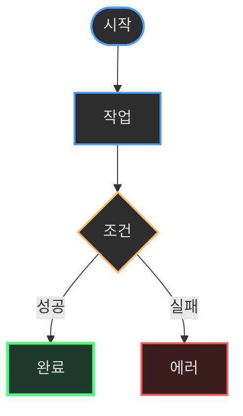

---

## Implementation Details

### Architecture

시스템 아키텍처 변경이 있는 경우 다이어그램 포함:

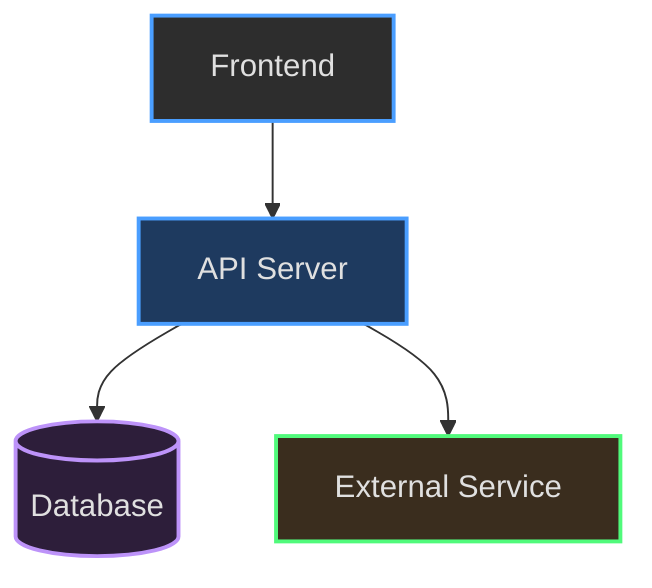

### Data Model

DB 변경이 있는 경우:

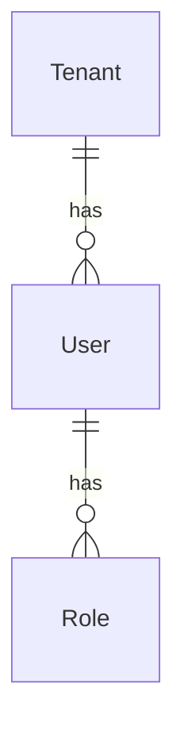

### API Endpoints

| Method | Endpoint | Description |
|--------|----------|-------------|
| POST | /v1/... | ... |
| GET | /v1/... | ... |

---

## Test Plan

- [ ] 유닛 테스트
- [ ] 통합 테스트
- [ ] E2E 테스트

---

## Stories

- [ ] Story XXX.1: [Title]
- [ ] Story XXX.2: [Title]

---

## References

- [관련 문서]
- [외부 참조]
```

### Story 문서 구조

Story는 **User Story 형식**을 따릅니다.

```markdown
# Story XXX.Y: [Title]

**EPIC**: EPIC-XXX
**Status**: ⏳ Pending | 🏗️ In Progress | ✅ Completed
**Priority**: P0 | P1 | P2
**Estimate**: X days

---

## User Story

**As a** [사용자 역할],
**I want** [기능],
**So that** [가치/이유].

---

## Acceptance Criteria

**Given** [전제 조건]
**When** [행동]
**Then** [예상 결과]

---

## Tasks

### Backend
- [ ] Task 1: DB 스키마 정의
- [ ] Task 2: Repository 메서드 구현
- [ ] Task 3: API 핸들러 작성
- [ ] Task 4: 유닛 테스트

### Frontend
- [ ] Task 5: API 타입 정의
- [ ] Task 6: TanStack Query hooks
- [ ] Task 7: UI 컴포넌트
- [ ] Task 8: 통합 테스트

---

## Technical Notes

<<[UNRESOLVED]>> 태그로 미결 사항 표시.

---

## Dependencies

- Story XXX.1 완료 후 시작 가능
```

### progress.md 구조

```markdown
# Progress Tracking: [Project Name]

**Last Updated**: YYYY-MM-DD

---

## Current EPIC

**EPIC-XXX**: [Title] (Status)

---

## Story Progress

| Story | Status | Tasks | Progress | Notes |
|-------|--------|-------|----------|-------|
| Story XXX.1 | ✅ Completed | 6/6 | 100% | - |
| Story XXX.2 | 🏗️ In Progress | 3/5 | 60% | 진행 중 |
| Story XXX.3 | ⏳ Pending | 0/4 | 0% | Story XXX.2 완료 후 |

**전체 진행률**: 9/15 (60%)

---

## Task Details

### Story XXX.2: [Title]

**Backend**
- [x] Task 1: DB 스키마 정의
- [x] Task 2: Repository 메서드 구현
- [x] Task 3: API 핸들러 작성
- [ ] Task 4: 유닛 테스트
- [ ] Task 5: 통합 테스트

**Frontend**
- (Story XXX.2 완료 후 시작)

---

## Daily Log

### 2025-11-29 (금)

**완료**:
- Story XXX.2: Task 1-3 완료
- Tenant CRUD API 구현

**진행 중**:
- Story XXX.2: Task 4 (유닛 테스트 작성 중)

**다음 작업**:
- Story XXX.2: Task 4-5 완료
- Story XXX.3 시작

**메모**:
- Keycloak Admin API 통합 이슈 해결
```

---

## Serena MCP 연동

### Serena MCP란?

Serena MCP는 Claude Code가 코드베이스를 분석하여 자동으로 프로젝트 지식을 생성하는 도구입니다.

**분석 결과 저장 위치**: `../.serena/memories/*.md`

**주요 기능**:
- `mcp__serena__get_symbols_overview`: 파일의 심볼(함수, 클래스) 목록
- `mcp__serena__find_symbol`: 특정 심볼의 본문 읽기
- `mcp__serena__find_referencing_symbols`: 심볼 참조 찾기
- `mcp__serena__search_for_pattern`: 패턴 검색

### Serena 사용 원칙

**❌ 하지 말 것**:
```javascript
// 파일 전체 읽기
Read("services/imprun-server/internal/api/v1/provider/subscriptions.go")
```

**✅ 올바른 방법**:
```javascript
// 1. 심볼 개요 먼저
const overview = mcp__serena__get_symbols_overview({
  relative_path: "services/imprun-server/internal/api/v1/provider/subscriptions.go"
});

// 2. 필요한 심볼만 본문 읽기
const symbol = mcp__serena__find_symbol({
  name_path_pattern: "ApproveSubscription",
  relative_path: "services/imprun-server/internal/api/v1/provider/subscriptions.go",
  include_body: true
});
```

### Serena Memory 보관

**언제 보관하나요?**
- 주간보고 전 (매주 금요일)
- 중요한 아키텍처 변경 전후
- EPIC 시작 전 (현재 시스템 상태 스냅샷)

**보관 방법**:
```bash
cd .context
node serena-sync/sync-memory.js
```

**대화형 모드**:
```
📋 5개 파일 발견:

  1. project-overview.md (2025-11-29, 12.3KB)
  2. auth-architecture.md (2025-11-28, 8.1KB)
  ...

보관할 파일 번호를 입력하세요 (예: 1,3,5 또는 all):
```

**자동 모드** (최근 7일):
```bash
node serena-sync/sync-memory.js --auto
```

**보관 위치**: `.context/archive/{프로젝트}/serena-YYYY-MM-DD-*.md`

### Serena Memory 활용

**EPIC 생성 시**:
```markdown
## Background

### 현재 시스템 상태

> 📊 **Serena Memory 기반**: `.context/archive/imp-gateway/serena-2025-11-29-project-overview.md`

현재 시스템은...
```

**주간보고 시**:
```markdown
### Serena 분석 요약

> 📊 **Serena Memory 기반**: `.context/archive/imp-gateway/serena-2025-11-29-*.md`

- 이번 주 아키텍처 변경: Repository 패턴 도입
- 새로운 패턴: Service 계층 분리
```

---

## 명령어 처리 흐름

### /create-epic

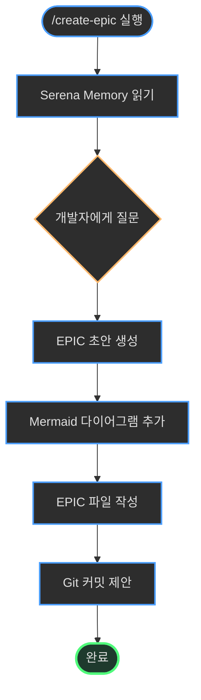

**핵심 단계**:
1. Serena Memory에서 현재 시스템 상태 파악
2. 개발자에게 EPIC 내용 질문
3. User Flow 등 Mermaid 다이어그램 생성 (다크 테마)
4. EPIC 파일 작성 (`.context/{프로젝트}/epics/EPIC-XXX-*.md`)
5. Git 커밋 제안

### /start-epic

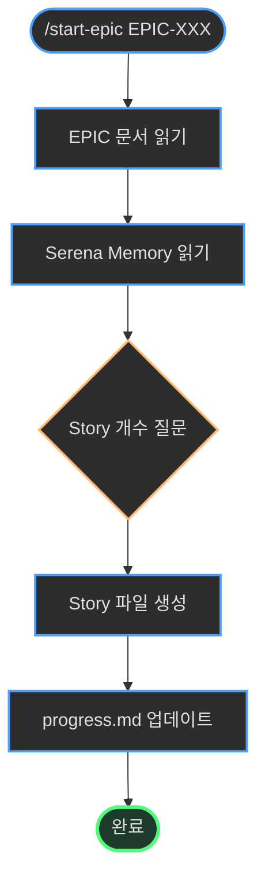

**핵심 단계**:
1. EPIC 문서 읽기
2. Serena Memory에서 기존 아키텍처 파악
3. EPIC을 Story로 분해 (개발자 피드백 반영)
4. Story 파일 생성 (`.context/{프로젝트}/stories/EPIC-XXX/story-X.Y.md`)
5. progress.md에 Story 테이블 추가

### /daily-start

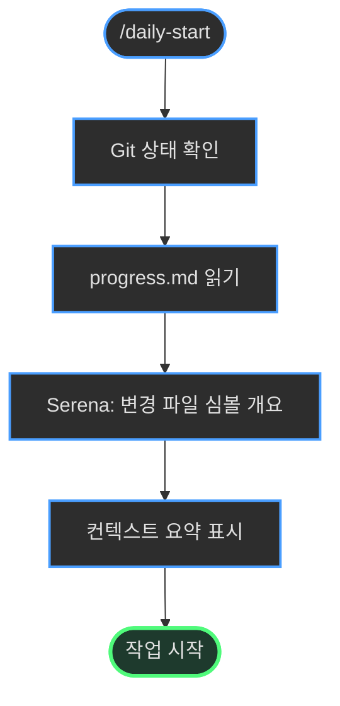

**핵심 단계**:
1. Git 상태 확인 (`git status`, `git diff --name-only`)
2. progress.md 읽기 (진행 중인 Story 확인)
3. Serena MCP로 변경 파일의 심볼 개요 확인
4. 컨텍스트 요약 제공

### /daily-end

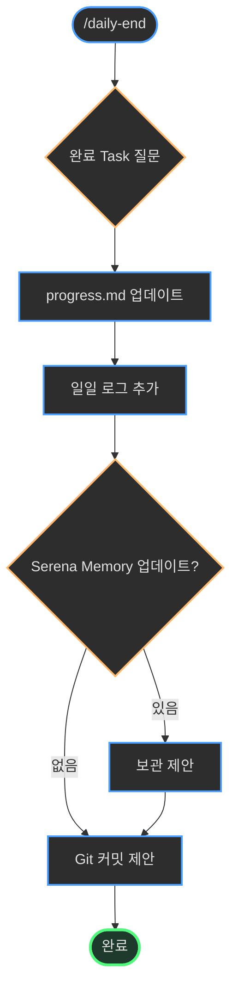

**핵심 단계**:
1. 개발자에게 완료한 Task 번호 질문
2. progress.md 업데이트 (체크박스, 진행률)
3. 일일 로그 추가
4. Serena Memory 업데이트 확인 → 보관 제안
5. Git 커밋 제안

### /sync-progress

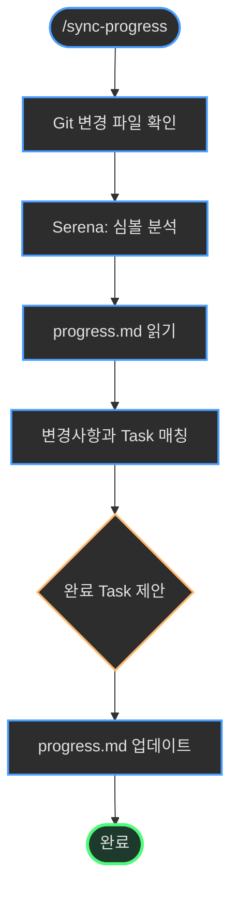

**핵심 단계**:
1. Git diff로 변경 파일 확인
2. Serena MCP로 심볼 분석 (어떤 기능이 구현되었는지)
3. progress.md 읽기
4. 변경사항과 Task 매칭 → 완료 제안
5. 개발자 확인 후 progress.md 업데이트

### /weekly-report

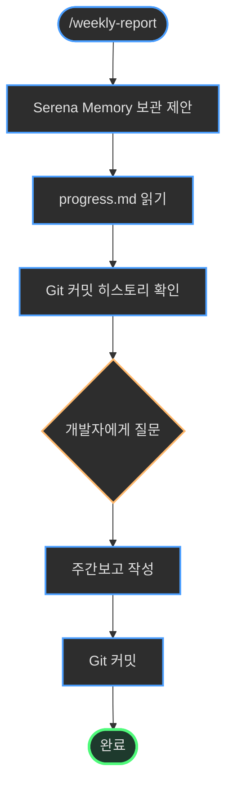

**핵심 단계**:
1. Serena Memory 보관 제안 (`node serena-sync/sync-memory.js --auto`)
2. progress.md 읽기 (Story 진행률)
3. Git 커밋 히스토리 확인
4. 개발자에게 질문 (완료 성과, 차단 이슈 등)
5. 주간보고 작성 (`.context/weekly/YYYY-MM-DD_YYYY-MM-DD.md`)
6. Git 커밋 및 팀 공유 제안

### /catchup

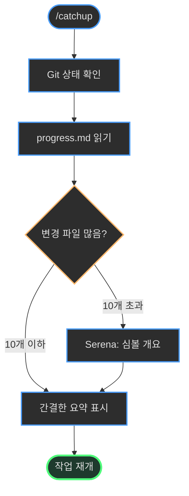

**핵심 단계**:
1. Git 상태 확인 (현재 브랜치, 변경 파일)
2. progress.md 읽기 (진행 중인 Story)
3. 변경 파일이 많으면 Serena MCP로 빠르게 개요 파악
4. 간결한 요약 표시 (5분 안에 상태 파악)

---

## GitHub 연동 전략

### 하이브리드 접근 방식

`.context` (문서 기반) + GitHub Issues (팀 협업) 병행:

| 측면 | .context | GitHub Issues |
|------|----------|---------------|
| **AI 친화성** | ✅ 구조화된 markdown | 일반 markdown |
| **팀 협업** | 수동 공유 | ✅ 알림, 라벨, 마일스톤 |
| **진행률 추적** | ✅ progress.md | Tasklist 진행률 |
| **영구 보관** | ✅ Git 히스토리 | Issue는 Close 가능 |

### 동기화 방향

**⚠️ 중요**: 동기화는 **일방향**입니다.

```
.context/progress.md  →  GitHub Issues
     (원천)              (복사본)
```

GitHub Issues에서 직접 체크박스를 클릭하면 다음 동기화 시 덮어씌워질 수 있음을 사용자에게 경고하세요.

### 동기화 워크플로우

```bash
# 1. EPIC 생성 및 동기화
/create-epic                    # EPIC 문서 작성
/sync-epic-to-github           # GitHub Issue #25 생성

# 2. Story 분해 및 동기화
/start-epic EPIC-025           # Story 파일 생성
/sync-stories-to-github EPIC-025  # Issues #26-30 생성 (sub-issues)

# 3. 일일 작업
/daily-end                     # progress.md 업데이트
/sync-progress-to-github       # GitHub Tasklist 동기화

# 4. 릴리즈
/generate-release-notes v0.1.0  # 릴리즈 노트 생성 (Draft)
```

### GitHub API 사용

GitHub 동기화 명령어는 `gh` CLI를 사용합니다:

```bash
# Issue 생성
gh issue create --title "EPIC-025: Tenant & User Management" \
  --body "$(cat .context/imp-gateway/epics/EPIC-025-tenant-user-management.md)"

# Sub-issue 생성
gh issue create --title "Story 25.1: Audit Log DB Schema" \
  --body "..." \
  --label "story" \
  --assignee "@me"

# Issue 번호를 EPIC/Story 파일에 기록
echo "**GitHub Issue**: #25" >> EPIC-025-tenant-user-management.md
```

---

## Mermaid 다이어그램 작성

### 다크 테마 색상 팔레트

**필수**: 모든 Mermaid 다이어그램은 다크 테마 색상을 사용해야 합니다.

```css
classDef darkNode fill:#2d2d2d,stroke:#4a9eff,stroke-width:2px,color:#e0e0e0
classDef darkDecision fill:#2d2d2d,stroke:#ffb86c,stroke-width:2px,color:#e0e0e0
classDef darkAPI fill:#1e3a5f,stroke:#4a9eff,stroke-width:2px,color:#e0e0e0
classDef darkDB fill:#2d1e3a,stroke:#bd93f9,stroke-width:2px,color:#e0e0e0
classDef darkExternal fill:#3a2d1e,stroke:#50fa7b,stroke-width:2px,color:#e0e0e0
classDef darkSuccess fill:#1e3a2d,stroke:#50fa7b,stroke-width:3px,color:#e0e0e0
classDef darkError fill:#3a1e1e,stroke:#ff5555,stroke-width:2px,color:#e0e0e0
```

### User Flow (필수)

모든 EPIC 문서는 User Flow 다이어그램을 포함해야 합니다.

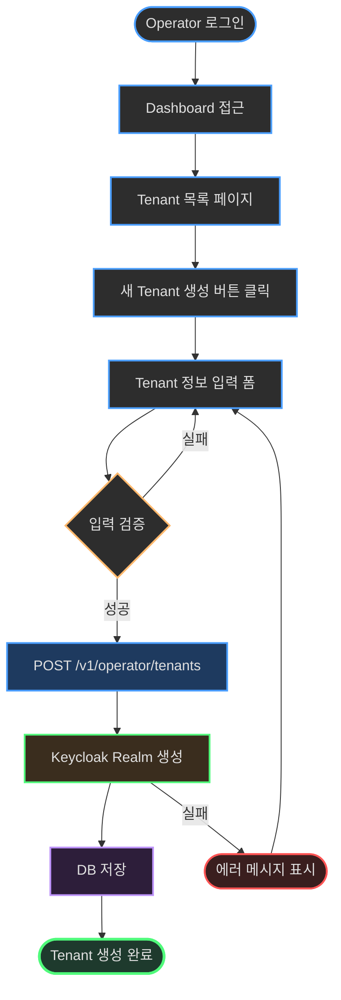

### System Architecture (시스템 변경 시)

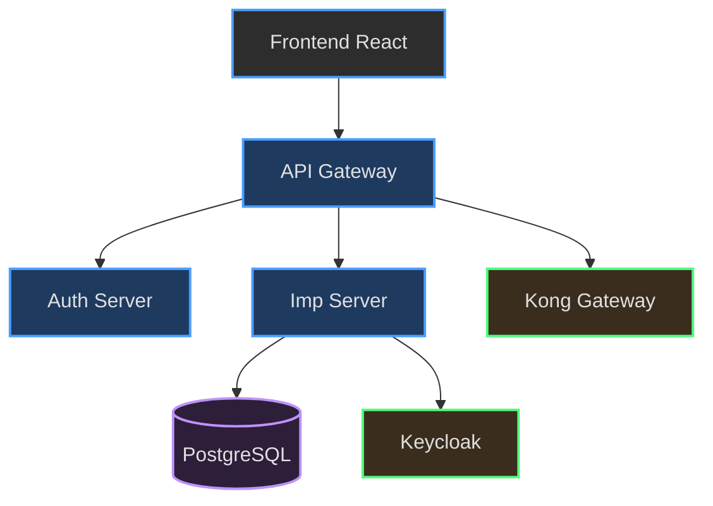

### Data Model (DB 변경 시)

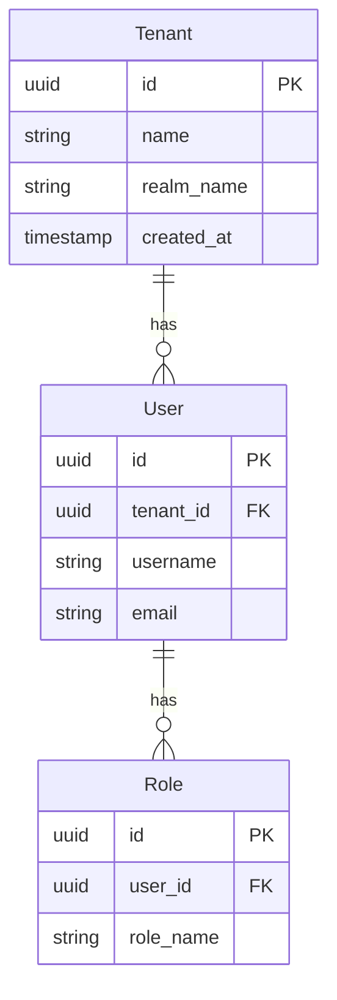

### API Sequence (복잡한 API 흐름)

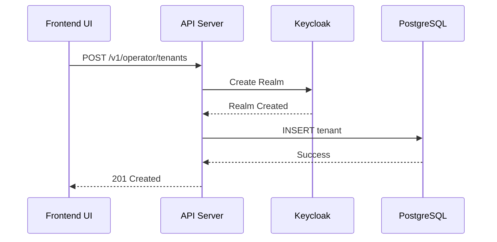

### 다이어그램 선택 가이드

| EPIC 유형 | 필수 다이어그램 | 선택 다이어그램 |
|-----------|----------------|----------------|
| **새 기능 추가** | User Flow | System Architecture (아키텍처 변경 시) |
| **DB 변경** | User Flow | Data Model |
| **복잡한 API** | User Flow | API Sequence |
| **리팩토링** | User Flow | System Architecture (Before/After) |

---

## 일일 작업 루틴

### 아침 루틴: /daily-start

```bash
# 1. 컨텍스트 복구
/daily-start

# 출력 예시:
# 📋 어제 작업 복기
#
# **EPIC-025**: Tenant & User Management (60% 완료)
# - Story 25.2: API Endpoints 🏗️ 진행중 (3/5 tasks)
#
# 🔍 변경된 코드 (Serena 분석):
# - internal/api/v1/operator/tenants.go: CreateTenant, ListTenants
# - internal/data/repo/tenant_repo.go: TenantRepository
#
# 🎯 오늘 목표:
# - Story 25.2: Task 4-5 완료
```

### 작업 중: 코드 작성

```bash
# Serena MCP로 코드 분석하며 작업
# (AI 에이전트가 자동으로 처리)
```

### 저녁 루틴: /daily-end

```bash
# 1. 일일 작업 정리
/daily-end

# 질문: 오늘 완료한 Task 번호를 알려주세요 (예: 25.2.4, 25.2.5)
# 답변: 25.2.4, 25.2.5

# 출력 예시:
# ✅ progress.md 업데이트 완료
#
# | Story | 변경 전 | 변경 후 |
# |-------|---------|---------||
# | Story 25.2 | 3/5 (60%) | 5/5 (100%) |
#
# 💡 Serena가 tenant-repository.md를 업데이트했습니다.
# 보관하시겠습니까? (y/n)

# 2. GitHub 동기화
/sync-progress-to-github
```

### 주간 루틴: 금요일 저녁

```bash
# 1. Serena Memory 보관
cd .context
node serena-sync/sync-memory.js --auto
git add archive/imp-gateway/
git commit -m "docs: 주간 Serena 메모리 보관"
git push

# 2. 주간보고 작성
/weekly-report

# 3. .context 커밋 및 푸시
cd .context
git add weekly/ imp-gateway/progress.md
git commit -m "docs(imp-gateway): 주간보고 2025-11-25"
git push
```

---

## 에러 처리 및 복구

### Serena MCP 에러

**증상**: `mcp__serena__*` 도구 호출 실패

**원인**: Serena MCP 서버 미설치 또는 연결 끊김

**해결**:
1. Serena MCP 설치 확인
2. Claude Code 재시작
3. Fallback: 일반 `Read` 도구 사용 (경고 메시지 출력)

### Git 충돌

**증상**: `.context` 디렉토리에서 merge conflict

**원인**: 여러 개발자가 동시에 progress.md 수정

**해결**:
```bash
cd .context
git status
# 충돌 파일 확인

# progress.md의 경우: 최신 버전 선택
git checkout --theirs imp-gateway/progress.md
git add imp-gateway/progress.md
git commit -m "fix: resolve merge conflict in progress.md"
```

### .context 디렉토리 소실

**증상**: `rm -rf .context` 또는 실수로 삭제

**해결 (Git 커밋된 경우)**:
```bash
# Git 복구
git checkout HEAD -- .context/

# 또는 리모트에서 클론
git clone https://github.com/imprun/.context.git .context
```

**해결 (Git 커밋 안 된 경우)**:
- 완전 소실
- AI 에이전트에게 재생성 요청: `/create-epic`, `/start-epic` 등 다시 실행
- **예방**: 작업 종료 시 항상 `git push` 습관화!

### GitHub 동기화 실패

**증상**: `gh` CLI 명령어 실패

**원인**: GitHub CLI 미설치 또는 인증 만료

**해결**:
```bash
# gh CLI 설치 확인
gh --version

# 인증
gh auth login

# 재시도
/sync-progress-to-github
```

---

## 모범 사례

### 1. 토큰 효율성

**❌ 나쁜 예**:
```javascript
// 파일 전체 읽기
Read("services/imprun-server/internal/api/v1/provider/subscriptions.go")
Read("services/imprun-server/internal/api/v1/provider/products.go")
Read("services/imprun-server/internal/api/v1/provider/plans.go")
```

**✅ 좋은 예**:
```javascript
// 심볼 개요만 확인
const files = [
  "services/imprun-server/internal/api/v1/provider/subscriptions.go",
  "services/imprun-server/internal/api/v1/provider/products.go",
  "services/imprun-server/internal/api/v1/provider/plans.go"
];

files.forEach(file => {
  mcp__serena__get_symbols_overview({ relative_path: file });
});

// 필요한 함수만 본문 읽기
mcp__serena__find_symbol({
  name_path_pattern: "ApproveSubscription",
  relative_path: "services/imprun-server/internal/api/v1/provider/subscriptions.go",
  include_body: true
});
```

### 2. 커밋 습관

**매일 저녁**:
```bash
cd .context
git add {프로젝트}/progress.md
git commit -m "docs({프로젝트}): 일일 진행상황 업데이트"
git push
```

**주간**:
```bash
cd .context
git add weekly/ archive/
git commit -m "docs: 주간보고 및 Serena 메모리 보관"
git push
```

### 3. Mermaid 다이어그램

**모든 EPIC 문서에 User Flow 포함**:
- 개발자가 한눈에 이해할 수 있도록
- 다크 테마 색상 사용
- 복잡한 흐름은 여러 다이어그램으로 분리

### 4. 미결 사항 표시

**`<<[UNRESOLVED]>>` 태그 사용**:
```markdown
## API 설계

POST /v1/provider/subscriptions/:id/approve

<<[UNRESOLVED]>>
승인 시 이메일 알림을 보낼지 여부 - 팀 논의 필요
```

### 5. Serena Memory 보관 주기

**주기적 보관**:
- 매주 금요일: `node serena-sync/sync-memory.js --auto`
- 중요 변경 전후: 수동 보관

**보관 기준**:
- 프로젝트 개요 (project-overview.md)
- 아키텍처 변경 (auth-architecture.md)
- 새로운 패턴 도입 (repository-pattern.md)

---

## 부록

### 명령어 빠른 참조

| 명령어 | 용도 | 빈도 |
|--------|------|------|
| `/create-epic` | EPIC 문서 생성 | EPIC 시작 시 |
| `/start-epic` | Story 분해 | EPIC 승인 후 |
| `/daily-start` | 컨텍스트 복구 | 매일 아침 |
| `/daily-end` | 진행상황 저장 | 매일 저녁 |
| `/sync-progress` | 코드-Task 매칭 | 필요 시 |
| `/catchup` | 빠른 상태 확인 (선택사항) | auto compact 후 |
| `/weekly-report` | 주간보고 생성 | 매주 금요일 |
| `/sync-epic-to-github` | EPIC → GitHub | EPIC 생성 후 |
| `/sync-stories-to-github` | Story → GitHub | Story 분해 후 |
| `/sync-progress-to-github` | progress.md → GitHub | 일일 종료 후 |

### Serena MCP 도구 참조

| 도구 | 용도 | 예시 |
|------|------|------|
| `get_symbols_overview` | 파일의 심볼 목록 | 함수, 클래스 확인 |
| `find_symbol` | 특정 심볼 본문 | 함수 구현 읽기 |
| `find_referencing_symbols` | 심볼 참조 찾기 | 어디서 호출되는지 |
| `search_for_pattern` | 패턴 검색 | 특정 문자열 찾기 |

### 다크 테마 색상 코드

| 용도 | 클래스명 | 색상 코드 |
|------|----------|----------|
| 일반 노드 | `darkNode` | `fill:#2d2d2d,stroke:#4a9eff` |
| 결정 노드 | `darkDecision` | `fill:#2d2d2d,stroke:#ffb86c` |
| API 서버 | `darkAPI` | `fill:#1e3a5f,stroke:#4a9eff` |
| 데이터베이스 | `darkDB` | `fill:#2d1e3a,stroke:#bd93f9` |
| 외부 서비스 | `darkExternal` | `fill:#3a2d1e,stroke:#50fa7b` |
| 성공 | `darkSuccess` | `fill:#1e3a2d,stroke:#50fa7b` |
| 에러 | `darkError` | `fill:#3a1e1e,stroke:#ff5555` |

---

**마지막 업데이트**: 2025-11-29
**버전**: 1.0.0
**관리**: Imprun 조직
**라이선스**: MIT
