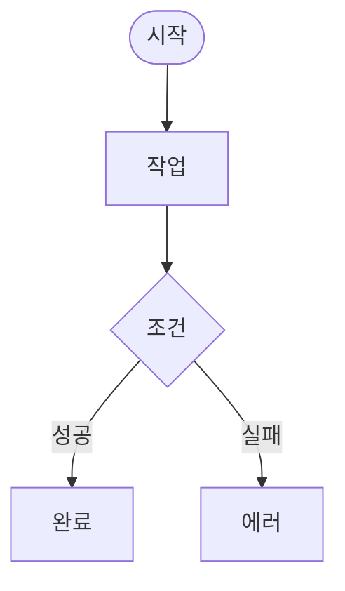
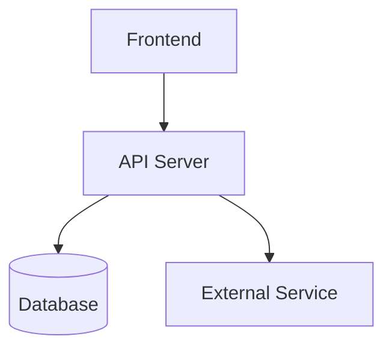
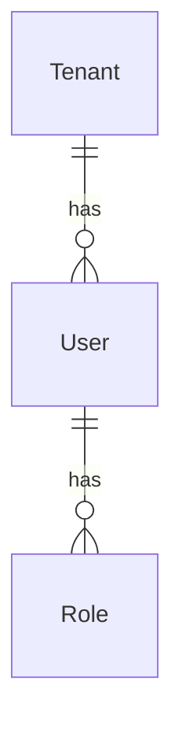
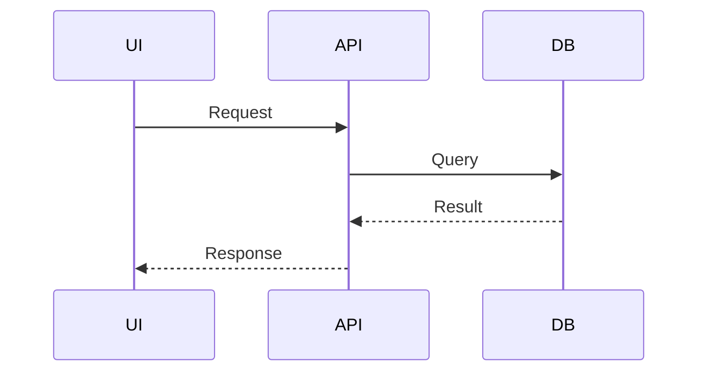

# .context - 프로젝트 컨텍스트 관리

`.context`는 **imprun 조직의 모든 레포지토리가 공유하는 개발 컨텍스트**입니다. EPIC, Story, 진행상황을 문서로 관리하고 AI 에이전트가 효과적으로 활용할 수 있도록 구조화되어 있습니다.

---

## 빠른 시작

### 1. .context 클론

```bash
cd /path/to/your-project
git clone https://github.com/imprun/.context.git .context
```

### 2. Claude Code 명령어 설치

```bash
cd .context
node install.js
```

**결과**: `.claude/commands/`에 명령어 템플릿이 자동으로 복사됩니다.

### 3. 바로 사용 시작

```bash
claude
/create-epic
```

---

## 디렉토리 구조

```
.context/
├── README.md              # 이 파일
├── CLAUDE.md              # AI 에이전트 지침
├── package.json           # npm 패키지 정의
├── install.js             # 명령어 설치 스크립트
│
├── templates/
│   └── commands/          # Claude Code 명령어 템플릿
│       ├── create-epic.md
│       ├── start-epic.md
│       ├── daily-start.md
│       ├── daily-end.md
│       ├── weekly-report.md
│       ├── sync-progress.md
│       ├── catchup.md
│       └── sync-*-to-github.md
│
├── serena-sync/           # Serena MCP 연동
│   ├── sync-memory.js
│   └── README.md
│
├── imp-gateway/           # 프로젝트별 폴더
│   ├── progress.md        # 진행상황 추적
│   ├── epics/             # EPIC 문서
│   ├── stories/           # Story 상세
│   └── releases/          # 릴리즈 히스토리
│
├── imprun-agent/          # 다른 프로젝트
├── imprun-console/        # 다른 프로젝트
│
├── weekly/                # 조직 전체 주간보고
└── archive/               # 과거 분석 문서
    ├── imp-gateway/
    │   └── serena-*.md
    └── imprun-agent/
```

---

## 주요 개념

### EPIC (Enhancement Proposal)

**Kubernetes KEP 스타일**의 큰 기능 단위 문서:
- 배경 (Background)
- 동기 (Motivation)
- 목표 (Goals & Non-Goals)
- 구현 세부사항 (Implementation Details)
- **Mermaid 다이어그램** (User Flow, Architecture, Data Model)
- 테스트 계획 (Test Plan)

**파일 위치**: `.context/{프로젝트}/epics/EPIC-XXX-*.md`

**예시**:
```
.context/imp-gateway/epics/EPIC-025-tenant-user-management.md
```

### Story (User Story)

EPIC을 구현 가능한 작은 단위로 분해:
- **As a** [user], **I want** [기능], **So that** [가치]
- Acceptance Criteria (Given/When/Then)
- Tasks (What만, How는 제외)

**파일 위치**: `.context/{프로젝트}/stories/EPIC-XXX/story-Y.Y.md`

### Progress Tracking

**Single Source of Truth**로 Task 완료 상태 추적:
- Story 진행률 테이블
- Task 체크리스트
- 일일 로그

**파일 위치**: `.context/{프로젝트}/progress.md`

---

## Claude Code 명령어

### EPIC 관리

- `/create-epic` - 새 EPIC 문서 생성 (Mermaid 다이어그램 포함)
- `/start-epic` - EPIC을 Story로 분해
- `/sync-epic-to-github` - GitHub Issue로 동기화

### 일일 작업

- `/daily-start` - 어제 작업 이어받기 (Serena MCP 활용)
- `/daily-end` - 오늘 작업 정리 및 저장
- `/sync-progress` - 코드 변경사항과 progress.md 동기화

### 주간 보고

- `/weekly-report` - 주간보고 생성 (Serena 분석 포함)

### 선택적 명령어

- `/catchup` - 빠른 상태 확인 (auto compact 후 또는 컨텍스트 손실 시)

### GitHub 동기화

- `/sync-stories-to-github` - Story를 GitHub Issues로
- `/sync-progress-to-github` - progress.md → GitHub Tasklist
- `/generate-release-notes` - 릴리즈 노트 자동 생성

---

## Serena MCP 연동

**Serena MCP**는 Claude Code가 코드베이스를 분석하여 자동으로 프로젝트 지식을 생성합니다.

### Serena Memory 보관

Serena의 분석 결과를 `.context/archive/{프로젝트}/`에 보관:

```bash
cd .context
node serena-sync/sync-memory.js
```

**대화형 모드**:
```
📋 5개 파일 발견:

  1. project-overview.md (2025-11-29, 12.3KB)
  2. auth-architecture.md (2025-11-28, 8.1KB)
  ...

보관할 파일 번호를 입력하세요 (예: 1,3,5 또는 all):
```

**자동 모드** (최근 7일):
```bash
node serena-sync/sync-memory.js --auto
```

### 사용 예시

**EPIC 생성 시**:
```bash
/create-epic
# → Serena memories를 읽어 현재 시스템 상태 파악
# → Background 섹션에 "현재 시스템 상태" 자동 포함
```

**주간보고 시**:
```bash
cd .context
node serena-sync/sync-memory.js --auto

/weekly-report
# → Serena 분석 요약이 주간보고에 포함됨
```

---

## GitHub 연동 워크플로우

### 하이브리드 접근 방식

`.context` (문서 기반) + GitHub Issues (팀 협업) 병행:

| 측면 | .context | GitHub Issues |
|------|----------|---------------|
| **AI 친화성** | ✅ 구조화된 markdown | 일반 markdown |
| **팀 협업** | 수동 공유 | ✅ 알림, 라벨, 마일스톤 |
| **진행률 추적** | ✅ progress.md | Tasklist 진행률 |
| **영구 보관** | ✅ Git 히스토리 | Issue는 Close 가능 |

### 동기화 워크플로우

```bash
# 1. EPIC 생성 및 동기화
/create-epic                    # EPIC 문서 작성
/sync-epic-to-github           # GitHub Issue #25 생성

# 2. Story 분해 및 동기화
/start-epic EPIC-025           # Story 파일 생성
/sync-stories-to-github EPIC-025  # Issues #26-30 생성 (sub-issues)

# 3. 일일 작업
/daily-end                     # progress.md 업데이트
/sync-progress-to-github       # GitHub Tasklist 동기화

# 4. 릴리즈
/generate-release-notes v0.1.0  # 릴리즈 노트 생성 (Draft)
```

---

## Mermaid 다이어그램 가이드

### 다크 테마 색상 팔레트

EPIC 문서에 사용자 흐름을 시각화할 때 다크 테마용 색상 사용:

```css
classDef darkNode fill:#2d2d2d,stroke:#4a9eff,stroke-width:2px,color:#e0e0e0
classDef darkDecision fill:#2d2d2d,stroke:#ffb86c,stroke-width:2px,color:#e0e0e0
classDef darkAPI fill:#1e3a5f,stroke:#4a9eff,stroke-width:2px,color:#e0e0e0
classDef darkDB fill:#2d1e3a,stroke:#bd93f9,stroke-width:2px,color:#e0e0e0
classDef darkExternal fill:#3a2d1e,stroke:#50fa7b,stroke-width:2px,color:#e0e0e0
classDef darkSuccess fill:#1e3a2d,stroke:#50fa7b,stroke-width:3px,color:#e0e0e0
classDef darkError fill:#3a1e1e,stroke:#ff5555,stroke-width:2px,color:#e0e0e0
```

### 다이어그램 종류

**User Flow** (필수):


**System Architecture** (시스템 변경 시):


**Data Model** (DB 변경 시):


**API Sequence** (복잡한 API 흐름):


---

## 모범 사례

### 1. 일일 작업 루틴

```bash
# 아침
/daily-start
# → 어제 진행 상황 복기
# → 오늘 목표 확인

# 코드 작성...

# 저녁
/daily-end
# → Task 체크
# → progress.md 업데이트

/sync-progress-to-github
# → GitHub 동기화
```

### 2. EPIC 작성 원칙

**"Merge early and iterate"**:
- 최소 완성본으로 먼저 PR
- 팀 리뷰로 점진적 개선
- 미결 사항은 `<<[UNRESOLVED]>>` 표시

**"What, not How"**:
- EPIC: 무엇을, 왜 (비즈니스 가치)
- Story: 구체적 What (API, UI)
- Code: How (구현)

**Mermaid 다이어그램 포함**:
- User Flow는 필수
- 복잡한 시스템은 Architecture Diagram 추가
- DB 변경은 Data Model Diagram 포함

### 3. Serena 활용

**주기적 보관** (매주 금요일):
```bash
cd .context
node serena-sync/sync-memory.js --auto
git add archive/{프로젝트}/
git commit -m "docs: 주간 Serena 메모리 보관"
git push
```

**중요 변경 전후**:
```bash
# Before: 대규모 리팩토링 전
node serena-sync/sync-memory.js

# ... 리팩토링 ...

# After: 리팩토링 후
node serena-sync/sync-memory.js
# → 변경 전후 비교 가능
```

### 4. 커밋 및 푸시 습관

`.context`는 **독립 Git 레포지토리**이므로 별도 커밋 필요:

```bash
# 1. .context 내부 변경사항 커밋
cd .context
git add imp-gateway/progress.md epics/ stories/
git commit -m "docs(imp-gateway): EPIC-025 진행상황 업데이트"
git push
```

**중요**: 하루 작업 종료 시 **반드시 push**하여 다른 팀원과 공유하고 백업 유지!

---

## 문제 해결

### Q: 명령어가 작동하지 않아요

**A**: 템플릿을 다시 설치하세요:
```bash
cd .context
node install.js
```

### Q: Serena MCP란 무엇인가요?

**A**: Claude Code가 코드를 분석하여 프로젝트 지식을 자동 생성하는 도구입니다.
- 설치: https://github.com/oraios/serena
- `.serena/memories/`에 분석 결과 저장
- `.context/archive/`에 중요한 분석 보관

### Q: GitHub Issues와 .context 중 어디에 우선순위가 있나요?

**A**: `.context/progress.md`가 **Single Source of Truth**입니다.
- progress.md 업데이트 → `/sync-progress-to-github`로 동기화
- GitHub에서 직접 체크박스 클릭은 권장하지 않음 (덮어씌워질 수 있음)

### Q: 실수로 .context를 삭제했어요!

**A**: Git에서 복구하거나 리모트에서 다시 클론:
```bash
# Git 복구
git checkout HEAD -- .context/

# 또는 리모트에서 클론
git clone https://github.com/imprun/.context.git .context
```

**예방**: 작업 종료 시 항상 `git push` 습관화!

---

## 관련 문서

- `CLAUDE.md`: AI 에이전트 상세 지침
- `serena-sync/README.md`: Serena MCP 연동 가이드
- `templates/README.md`: 명령어 템플릿 관리

---

**마지막 업데이트**: 2025-11-29
**관리**: Imprun 조직
**라이선스**: MIT
